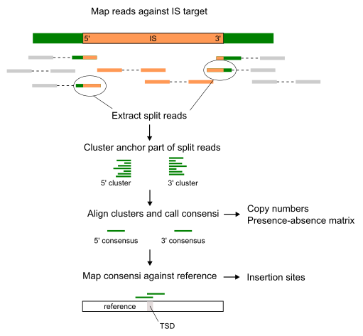

A tool to detect and characterize insertion sequence polymorphisms and copy numbers in bacterial genomes **without using a reference genome**. 

Developed for the study of IS6110 in *Mycobacterium tuberculosis*, but in principle applicable to any IS in any species.


# Method
Polymorphisms are characterized by the sequence of the region flanking an insertion (the "anchor" sequence) rather than a reference-based insertion location. Anchors can optionally be mapped against the reference to obtain the subset of polymorphisms with clear reference insertion signatures.




# Install

## Via conda (recommended)
```bash
conda install -c bioconda detettore6110
```

## From source
Clone the repository and install in development mode:

```bash
git clone https://github.com/cstritt/detettore6110
cd detettore6110
pip install -e .
```

Or create a conda environment with the required Python packages:

```bash
conda env create -f environment.yaml -n detettore6110
conda activate detettore6110
pip install -e .
```

# Run 
The only required input are reads in fastq format. For the reference genome and the IS target (IS6110) the defaults in the resources folder are used if not stated otherwise. 

Below is the simplest way to run detettore, using IS6110 as a target and the imputed ancestor MTBC0 ([Harrison et al. 2024](https://doi.org/10.1099%2Fmgen.0.001165)) as a reference.

## Reference-free
```bash
detettore6110 find testing/some_reads.fastq.gz \
  -t resources/is_targets/IS6110.fasta \
  -o output_dir \
  -p sample_name
```

## With reference
```bash
detettore6110 find testing/some_reads.fastq.gz \
  -t resources/is_targets/IS6110.fasta \
  -r resources/reference/MTBC0_v1.1.fasta \
  -a resources/reference/MTBC0v1.1_PGAP_annot.gff \
  -o output_dir \
  -p sample_name
```

## Summarize results
```bash
detettore6110 summarize \
  -i path_to_detettore_results \
  -o output_dir \
  -r resources/reference/MTBC0_v1.1.fasta
```

# Output

### **PREFIX.anchors.tsv**

| Column | Description |
|--------|-------------|
| anchor_id | Identifier of the anchor sequence |
| side | On which side the anchor is situated relative to the IS target |
| num_reads | The number of reads that cluster at this side |
| consensus | The consensus sequence of the clustered reads |
| anchor_entropy | Average site entropy of the aligned clustered reads |
| target_entropy | Average site entropy of the aligned read parts that map against the IS |
| ref* | The refernece chromosome name |
| ref_start* | Start of the consensus mapped against the reference |
| ref_end* | End of the consensus mapped against the reference |
| ref_strand* | Reference strand |
| ref_cigar* | Cigar of the mapped consensus sequence |
| ref_mapq* | Mapping quality of the mapped consensus sequence |

*Only when a reference genome is provided. 

Anchor and target entropies indicate how messy the alignment of anchor and hit reads are. Given that the reads should be derived from a single strain, the alignment should be clean, with only few sequencing errors and entropy values below 0.1.


### **PREFIX.reference_insertions.tsv**

| Column | Description |
|--------|-------------|
| chromosome | Reference chromosome |
| position | Insertion site position |
| strand | Strand of the insertion |
| TSD | Sequence of the target site duplication |
| support_5 | Number of split reads supporting insertion at the 5' side |
| support_3 | Number of split reads supporting insertion at the 3' side |
| support_ref | Number of reads supporting the absence of the insertion |
| anchor_5 | Identifier of the 5' anchor mapping to this insertion site |
| anchor_3 | Identifier of the 3' anchor mapping to this insertion site |
| mapq_5 | Mapping quality of the 5' anchor |
| mapq_3 | Mapping quality of the 3' anchor |
| cigar_5 | Cigar quality of the 5' anchor |
| cigar_3 | Cigar quality of the 3' anchor |
| gene* | Gene or intergenic region where the IS inserted. Intergenic regions are indicated by two gene names separated by ; |
| dist_to_gene* | Distance of the insertion to the gene specified above |

*Only when an annotation is provided.


Note that **only clear split read insertion signatures** are reported. This means that the reference-independent copy number estimate is usually higher than the number of inferred insertion sites, as insertions into complex regions (repeats, SVs, ...) tend to produce more complicated and ambiguous signatures, or none at all. 
